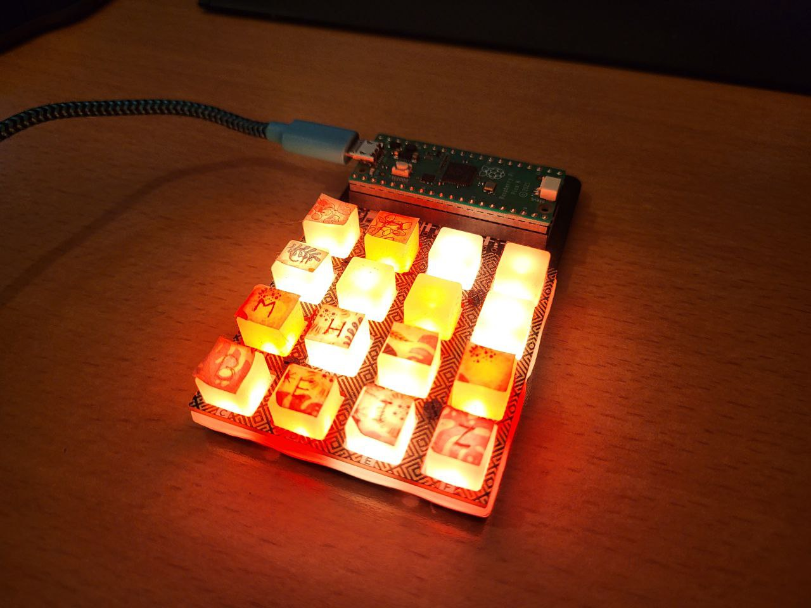

A simple script to set the keys on a Pico RGB Keypad.  
Runs on: Raspberry Pi Pico

<b> Required libraries: </b>  
<i> PMK - Pimoroni Mechanical/Mushy Keypad - CircuitPython </i>  
https://github.com/pimoroni/pmk-circuitpython

<i> Adafruit_hid - CircuitPython </i>  
https://docs.circuitpython.org/projects/hid/en/latest/index.html

